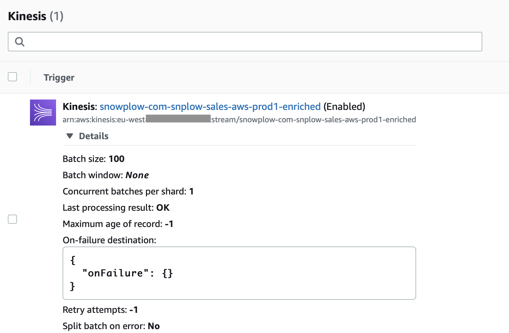
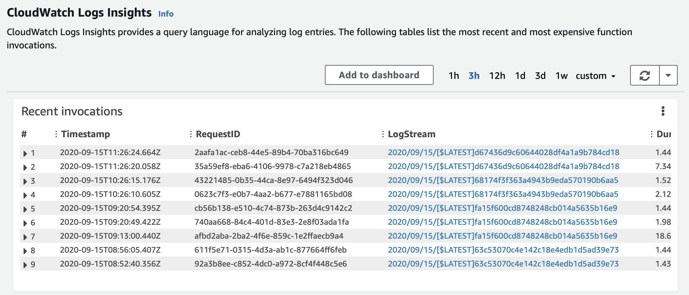
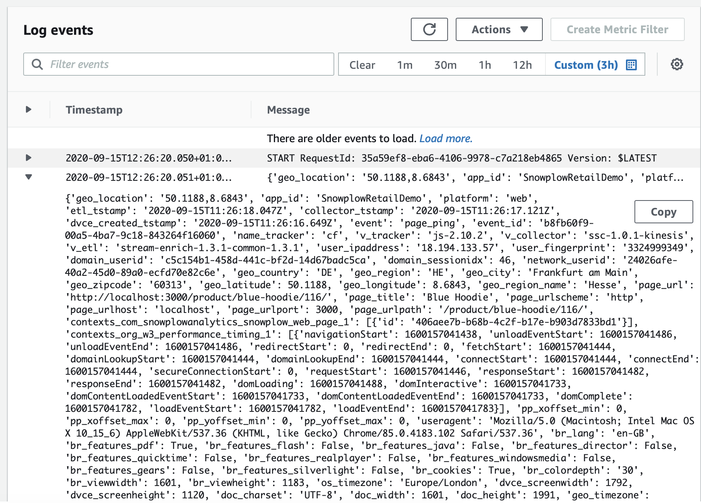

Taking action on event data in real time is a popular feature of Snowplow. We have customers using this to power use cases including:
*   __Retail:__ If someone fills up their shopping cart and then leaves, they can receive a notification with an enticement to check out. 
*   __Customer support:__ Providing support staff with informaiton on where a user is stuck at the same time as they call the support line. 
*   __Machine Learning:__ Feeding algorithms with data in real time for decision making

Once you have snowplow set up, it only takes a couple steps to start reading data from the real time stream. This guide will show you how to achieve this in AWS using a Python Lambda function. 


# Tutorial
This is a really simple tutorial of reading from the real time stream. What we're going to do is set up a lambda function to trigger when data is received by the Good Kinesis stream, transform the data into JSON with the Snowplow SDK and log the output to CloudWatch. Data that is received on the Good Kinesis stream has passed through the validation and enrichment steps in this diagram. 


## Prerequisites
If you haven't got a snowplow pipeline set up in AWS using Kinesis streams this next part is not going to make much sense. If you're unsure [check out here to get started!](https://snowplowanalytics.com/get-started/). 

## Set up IAM in AWS
For this tutorial your lambda function needs a role with permission to do the following: 
```
"kinesis:GetRecords",
"kinesis:GetShardIterator",
"kinesis:DescribeStream",
"kinesis:ListStreams",
"logs:CreateLogGroup",
"logs:CreateLogStream",
"logs:PutLogEvents"
```

## Create the lambda function
Create a new Lambda function and give it the following properties: 
Name: lambda_function_payload
Runtime: Python 3
Permissions: Use existing role, and select the role you made in the previous step


## Add a trigger to connect it to the good kinesis stream



## Create the Python script
Copy this Python script to a file locally. In my case, it's called lambda_function_payload.py and is inside a subdirectory called lambda_function_payload. This subdirectory is important for the next step. 

```python
import snowplow_analytics_sdk.event_transformer
import snowplow_analytics_sdk.snowplow_event_transformation_exception
import json
import base64

# Decode batch of lambda records from Base64 to TSV
def decode_records(update):
    data = []
    if "Records" in update:
        for record in update["Records"]:
            if "kinesis" in record and "data" in record['kinesis']:
                decoded_data = base64.b64decode(record['kinesis']['data']).decode('utf-8')
                data.append(decoded_data)
    return data

# Entry point for the lambda function
def lambda_handler(event, context):
    # print("Received event: " + json.dumps(event, indent=2)) 

    # Decode received batch of records from Base64 to TSV
    records = decode_records(event)

    for record in records:
        try:
            # Transform record from TSV to JSON
            print(snowplow_analytics_sdk.event_transformer.transform(record))
            print("Succesfully retrieved and transformed event")
        except snowplow_analytics_sdk.snowplow_event_transformation_exception.SnowplowEventTransformationException as e:
            for error_message in e.error_messages:
                print(error_message)
            continue
        
    return
```

## Package and upload the Python script
Package a zip file for lambda with the following script. Copy it to a new file and place it in the directory above the python script. Note that this is being run on a subdirectry with the Python app called lambda_function_payload.py. The Python fuction above is written in Python 3 the script will install the [Snowplow Python SDK](https://github.com/snowplow/snowplow/wiki/Python-Analytics-SDK-Setup) in the directory so that it is included in the zip file.

```bash
#!/bin/bash
cd lambda_function_payload
pip3 install snowplow_analytics_sdk -t . --upgrade
chmod -R 755 .
zip -r ../lambda_function_payload.zip .
cd ..
```

Upload the zip file to lambda in the AWS Console. Since the dependency is a couple of mb, we won't be able to see and edit the code in AWS. 


## Test and confirm events are being processed
Send some events into your Snowplow and give them a couple seconds to process. Click on monitoring on the lambda fuction page and scroll down to CloudWatch logs. You should see some entries appearing. 



Looking at the logs, you should see something like this appearing. What you see here is the entire event's data in JSON format ready to be used.


# Okay, what next? 
Now that you have data coming out of the real time stream. Here are some other articles with ideas on what you can do with it
*   [How real-time data enables personalization and engagement](https://snowplowanalytics.com/blog/2019/09/27/how-real-time-data-lets-media-companies-personalize-content-messaging-and-advertising/)
https://snowplowanalytics.com/blog/2019/03/06/
*   [Snowplow for retail part 5](snowplow-for-retail-part-5-what-can-we-do-with-data-when-were-well-established/)

If you want to learn more about what you can achieve wth Snowplow, [get in touch today!](https://snowplowanalytics.com/get-started/)